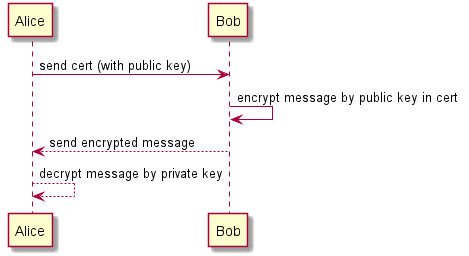

# 程序员的浪漫

之前学习TLS时向一个做安全的朋友请教，过程中他给我讲了下面一个故事。听完后甚是感动，分享给大家。

为了方便描述，以我朋友的视角进行描述。

## 背景
公司开发的产品涉及安全时都要求使用TLS通信，TLS通信时需要使用证书。申请证书时需要预先制作好私钥，私钥与证书里的公钥形成密钥对。非对称加密可以粗略的理解为，通信前将你的证书发给对端，对端使用你证书中的公钥进行加密。加密后的密文只有对应的私钥才可以解密。只要私钥不泄密，就可以保证安全。

但通信时是需要使用私钥进行解密的，所以私钥也需要存储在服务器上。如果服务器被攻破，私钥被窃取，这样也很危险。所以使用openssl制作私钥时一般都要求提供一个密码来保护私钥。一般支持TLS的工具都支持加载加密后的私钥和密码来进行通信。

但是密码也是需要存储的，密码泄露也存在安全风险。更近一步的方法就是使用对称加密将私钥密码也进行加密，解密只能使用特定的工具进行。工具被编译成二进制文件，解密直接在内存进行，解密后的密码和私钥不存储，直接使用。

## 私钥
希望看完上面一段背景之后你还没有晕。

从上面我们可以看出，实际使用中一般开发人员是没机会接触到私钥密码的，大家直接使用加密后的私钥和密码就可以了。实际中也是这样。产品开发中都使用预置的证书、私钥，交付后由客户替换为商用证书就可以了。开发人员也不会关注预置证书是哪里来的，怎么生成的。

一次我们启动新项目，特殊原因要求我们更新一份新的证书。但替换后出了岔子，小部分业务无法相互通信，我被要求定位清楚问题出在哪里。为了确认是证书误用还是业务处理的问题，我需要把加密后的私钥解密，然后和公钥校验。折腾了小半天，拿到校验结果之后，我终于说服其他开发是他们的业务处理的问题。这个问题也就结束了。

## 私钥密码
解密私钥时，我需要先把私钥密码解密出来。搞定了问题之后，我又回想起那个私钥密码。那个密码很特殊，明显是人名全拼+数字组成的，这激起了我的好奇心。我本以为这数字是一个工号，查了一下并没有，难道已经离职了？又查了一下人名全拼，这次倒是查到了几位，挨个看了之后感觉都不太可能。

这时我的八卦之魂已经熊熊燃烧，停不下来了。那就最简单的方法，查一下这个文件的修改记录。这一下就锁定了第一次添加这个文件的哥们。然后我就试探性的发了个消息确认了下，至此真相大白了。

## 程序员的浪漫
私钥密码是这个开发人员女朋友的名字+生日组成的。创建的时候，他认为反正也不会有人用到密码，就决定埋这么一个彩蛋。

但他女朋友不是我们公司的，我不清楚他有没有告诉她。甚至，我都怀疑即使他告诉她这个浪漫的故事，她是否在完全听懂前就被前面那一大堆概念整懵了。

试想一下，服务器间每次建链时都要相互确认一下身份，都需要正确喊出她的名字才能通行。全球各地千万个机房里风扇轰鸣，机架上服务器网口灯快速闪烁着，这巨大的比特洪流都在默念着她的名字，不分昼夜。
