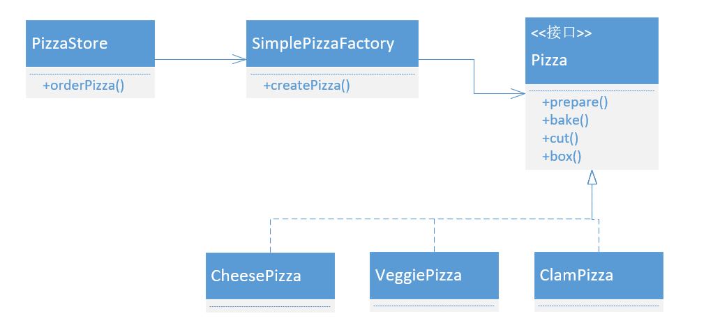
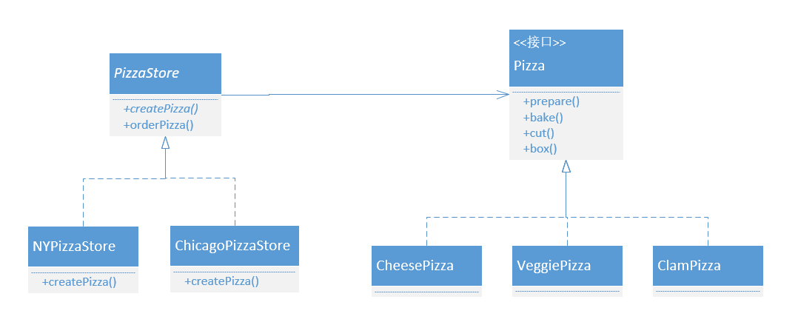

> 工厂模式定义了一个创建对象的接口，但由子类决定要实例化的类时哪一个。工厂方法让类把实例化推迟到子类。

# 简单工厂

简单工厂的思路也确实非常简单，就像将创建类的代码进行了简单的抽离。《设计模式》也说这不应该算一种模式，更像一种编程习惯。就好比撸完代码之后自己回头看看，发现这一块独立的逻辑可以抽离出来独立一下。

# 工厂模式

工厂模式中，创建者与产品为平行类层级，只是创建者的创建方法产生产品。要创建哪种产品，由具体的创建者子类决定；产品的实际创建，也由产品的具体实现类完成。

# 代码

略

# 后记

提到设计模式，大家都能想到GOF，23种设计模式，工厂，单例，观察者等一堆名词，面试题中似乎也偏爱单例有多少种实现这种问题，虽然我没有遇到过。

大概是《大话设计模式》说过，类似看山不是山，学习设计模式也分几个阶段：不懂设计模式；能辨别各种设计模式；能刻意使用各种模式；各种模式用起来化于无形。

工作后感觉这几个阶段也不是完全线性递进的，比如虽然不能准确说出所有的23种模式，但相信大家都能写出单例模式；自觉自己处于辨别和使用中间吧。

想重新拾起设计模式，是前一阵在别人带领下刚好使用了策略模式，感觉很不错。但再看其它模式，发现并没有实际使用策略模式那种震撼。比如观察者模式，虽然以前不懂，但实现一次接口回调功能，也能自己发明一遍。

上面这么多是想说，《设计模式》对我已经没有那么强烈的吸引力了，写博客算是一种复习或者了解一下这个名词，所以代码也省了。如果想学习设计模式，推荐《head first设计模式》这本书，非常好。今后尽量更新一些自己觉得有趣的内容。