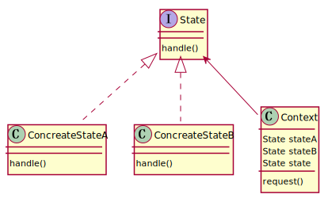

> 状态模式允许对象在内部状态改变时改变它的行为，对象看起来好像修改了它的类。

工作中经常会遇到各种状态机，使用流程控制的方式虽然也可以实现，但后续的维护变动就变得很困难。在实际中我们现在就遇到了一个这样子的问题，整个状态机的代码有一千多行，代码完成的还算工整，但要看懂现在就只能对比状态图了，因为状态实在太多了。我曾经增改过两次，每次改动都伴随着一大堆的问题单。

这时候就真真切切体会到状态模式的好处了。

# 类图

# 状态模式 vs 策略模式

如果与策略模式的类图对比的话，会发现图结构几乎一模一样。虽然如此，这俩模式还是有比较明显的区别。

策略模式中，最后的每一个业务类只包含了一组算法中的一个实现；或者说每一种算法的组合形成了一个业务类。

但在状态模式中，业务类中继承了算法的所有实现，并且在运行态切换算法为不同的实现，从而让自己拥有不同的行为（表现为不同的状态）。

我觉得类比之前策略模式中不同种类鸭子的实现，状态模式只存在一只百变鸭，但这只鸭子根据外界输入一会将自己变成红头鸭吱吱叫，一会儿变成绿头鸭呱呱叫。

# 代码

略