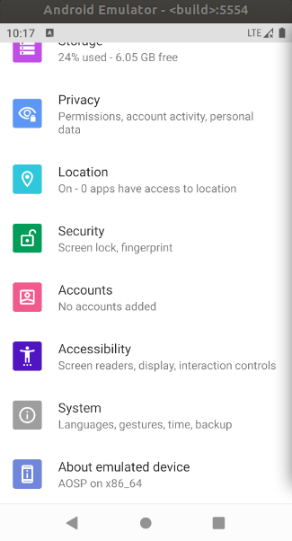
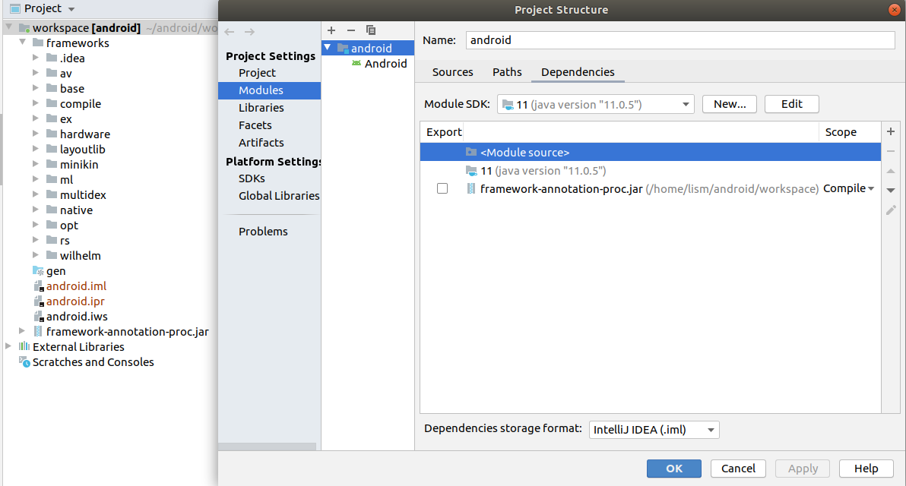

## 下载源码

国内从google下载aosp源码需要翻墙，很不方便。可以使用[清华大学开源软件镜像站](https://mirrors.tuna.tsinghua.edu.cn/help/AOSP)提供的镜像地址进行下载,同步代码.

下载,检出代码按照清华镜像站的地址说明一步步操作就可以了.

### 可能的错误

- 初始化包比较大,下载后记得进行md5校验.
- 使用迅雷中断后续传,发现md5值不匹配,推荐使用```uget```之类的工具在晚上下载,一次成功.

## aosp编译

官方指导

- [建立编译环境](https://source.android.google.cn/setup/build/initializing)
- [编译 Android](https://source.android.google.cn/setup/build/building)

编译很简单, aosp源码中```prebuilts```目录下集成了所有编译会用到的工具,包括clang, jdk等,不需要额外下载. 编译脚本只支持```python2```,环境上安装一下```python2```就可以了.

在Ubuntu 18.04上使用如下步骤进行编译:

### 设置环境变量等

```bash
source build/envsetup.sh
```

### 设置编译目标版本

```bash
lism@lism-u18:~/android/aosp$ lunch aosp_x86_64-eng 

============================================
PLATFORM_VERSION_CODENAME=R
PLATFORM_VERSION=R
TARGET_PRODUCT=aosp_x86_64
TARGET_BUILD_VARIANT=eng
TARGET_BUILD_TYPE=release
TARGET_ARCH=x86_64
TARGET_ARCH_VARIANT=x86_64
TARGET_2ND_ARCH=x86
TARGET_2ND_ARCH_VARIANT=x86_64
HOST_ARCH=x86_64
HOST_2ND_ARCH=x86
HOST_OS=linux
HOST_OS_EXTRA=Linux-5.0.0-37-generic-x86_64-Ubuntu-18.04.3-LTS
HOST_CROSS_OS=windows
HOST_CROSS_ARCH=x86
HOST_CROSS_2ND_ARCH=x86_64
HOST_BUILD_TYPE=release
BUILD_ID=QD1A.190821.011
OUT_DIR=out
============================================
```

如果不清楚需要输入什么版本, 输入```lunch```后会自动列出支持的版本信息.

```bash
lism@lism-u18:~/android/aosp$ lunch

You're building on Linux

Lunch menu... pick a combo:
     1. aosp_arm-eng
     2. aosp_arm64-eng
     3. aosp_blueline-userdebug
     4. aosp_bonito-userdebug
     5. aosp_car_arm-userdebug
     6. aosp_car_arm64-userdebug
    ...
```

### 编译aosp

```bash
make -j 16
```

参数```-j```后跟的时并发数,不指定时系统会自动设置为```CPU核数+2```. 这一步比较费时间,我是在睡觉前执行的,也没有统计具体时间.

### 编译可能的错误

- 第1次编译时自动停止了,编译系统提供了2个选项让选择,但电脑重启了并没有选择,也没有保留错误信息.重新执行一次编译命令就好了.
- 官方说支持在LTS版本上进行,手贱把系统升级到了ubuntu 20.04预览版,发现找不到动态库,但实际```prebuilts```里有,手动增加```LD_LIBRARY_PATH```也没有解决.系统回退到18.04就好了.
- 有一次同步代码后,提示有一个golang的aidl测试用例过不去,分析了半天没有解决,根据错误提示,就在那个模块的用例列表里通过注释屏蔽了那个用例就编译成功了,但悲剧的时模拟器起不来,也不清楚是否和这个有关系.
- 开始也尝试了在win 10 的wsl中上进行编译, 发现只支持在大小写敏感的环境进行.修改磁盘属性也可以解决这个问题,但很快又遇到了其它问题就放弃了.官方指导中也没有说支持windows下编译.

## 运行aosp

编译结束后直接执行```emulator```就可以通过```qemu```加载运行刚编译得到的```system.img```等镜像了. 但```qemu```模拟器需要```kvm```支持.

### 安装kvm

#### 主板开启虚拟化支持

我是用AMD CPU, 进入bios后打开对应的KVM虚拟化开关就好了. Intel CPU应该VT虚拟化开关,这个按照主板bios的说明操作就好了.

#### 安装kvm软件

```bash
sudo apt-get install qemu-kvm qemu-system libvirt-bin  bridge-utils
```

安装之后, 输入```kvm-ok```如果输出显示正常就ok了.

#### kvm权限

安装好之后使用```emulator```可能会提示kvm permission之类的问题.实际查看也可以看到kvm文件的属主.

```bash
lism@lism-u18:~/android/aosp$ ll /dev/kvm 
crw-rw---- 1 root kvm 10, 232 1月  12 23:38 /dev/kvm
```

将自己的用户添加到```kvm group```中,并增加权限就好了.

```bash
sudo adduser <username> kvm
sudo chown <username> /dev/kvm
```



### 运行模拟器可能的错误

- 如果模拟器启动到一半因为各种问题强杀了,再次启动的时候报```cache.img.qcow2```之类的错误,按照提示说明,将对应目录下的```*qcow2```文件删掉重启就好了.

## 阅读aosp源码

阅读aosp源码可以使用source insight这类自动分析代码,支持函数跳转的工具,但我一直没学会.如果能导入到android studio中并进行函数跳转就好了. 

aosp中就提供了idegen这个小工具,通过遍历源码目录,自动生成```IDEA```系支持的工程文件.

### 使用idegen生成工程配置文件

#### 编译idegen

```bash
lism@lism-u18:~/android/aosp$ source build/envsetup.sh 
lism@lism-u18:~/android/aosp$ mmm development/tools/idegen/
============================================
PLATFORM_VERSION_CODENAME=R
PLATFORM_VERSION=R
TARGET_PRODUCT=aosp_x86_64
TARGET_BUILD_VARIANT=eng
TARGET_BUILD_TYPE=release
TARGET_ARCH=x86_64
TARGET_ARCH_VARIANT=x86_64
TARGET_2ND_ARCH=x86
TARGET_2ND_ARCH_VARIANT=x86_64
HOST_ARCH=x86_64
HOST_2ND_ARCH=x86
HOST_OS=linux
HOST_OS_EXTRA=Linux-5.0.0-37-generic-x86_64-Ubuntu-18.04.3-LTS
HOST_CROSS_OS=windows
HOST_CROSS_ARCH=x86
HOST_CROSS_2ND_ARCH=x86_64
HOST_BUILD_TYPE=release
BUILD_ID=QD1A.190821.011
OUT_DIR=out
============================================
[100% 559/559] Install: out/host/linux-x86/framework/idegen.jar

#### build completed successfully (4 seconds) ####
```

#### 使用idegen生成IDEA工程文件

```bash
lism@lism-u18:~/android/aosp$ bash development/tools/idegen/idegen.sh 
Read excludes: 9ms
Traversed tree: 40644ms
```

执行之后,它会在源码根目录自动生成如下两个文件

```bash
lism@lism-u18:~/android/aosp$ ll android*
-rw-r--r-- 1 lism lism 706237 1月  13 01:05 android.iml
-rw-r--r-- 1 lism lism  16569 1月  13 01:05 android.ipr
```

### IDEA打开代码

#### IDEA or Android Studio

使用```IDEA```或```Android Studio```直接打开```ipl```文件就加载整个aosp工程了.使用```Android Studio```默认会加载```android sdk```,这样在函数跳转时可能会优先跳转到sdk的代码中,但sdk中的代码相比源码只有部分实现,特别是与底层交互的部分.网上很多教程会指导在```Android Studio```中新建一个只包含jdk的工程配置, 但直接```IDEA```就可以省去这些麻烦.

#### 修改IDEA JVM参数

aosp代码还是很庞大的, 修改IDEA对应的JVM参数, 增大堆内存, 防止OOM或不停的触发GC导致IDEA挂起, 体验不好.

在```help > Edit Custom JVM Options```中根据自己的电脑配置修改如下参数:

```java
-Xmx4096m
```

#### 部分导入源码

aosp中大多数代码都是硬件驱动, 第3方依赖库, 甚至jdk等. idegen生成的工程配置中也包含了这些目录. 如果都导入, 还是很吃电脑性能的, 也完全没有必要. 我们可以将自己关注的模块比如```framework```和生成的```android.ipl```和```android.iml```文件移动到新的文件夹下,并保持目录结构不变, 这样打开速度会快很多.

### AIDL自动生成代码

android中大多数IPC通信均使用binder机制. aosp中提供了aidl工具, 服务端将接口使用aidl文件进行描述, 编译时自动生成服务端Interface和客户端调用的proxy类. 但这给源码阅读带来了麻烦.

- 代码中存在大量的类型未定义
- IPC调用相关的代码无法跳转

解决方法就是将编译生成的framework对应的jar作为```lib```导入到工程中, jar包中已经包含了AIDL最终生成的代码, IDEA会自动分析代码间的引用关系, 可以方便的查找,跳转. 可以使用如下路径下的jar

```bash
out/soong/.intermediates/frameworks/base/framework-annotation-proc/android_common/combined/framework-annotation-proc.jar
```


